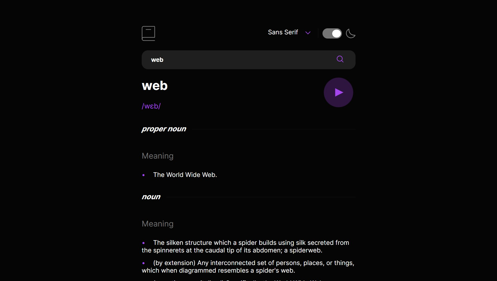
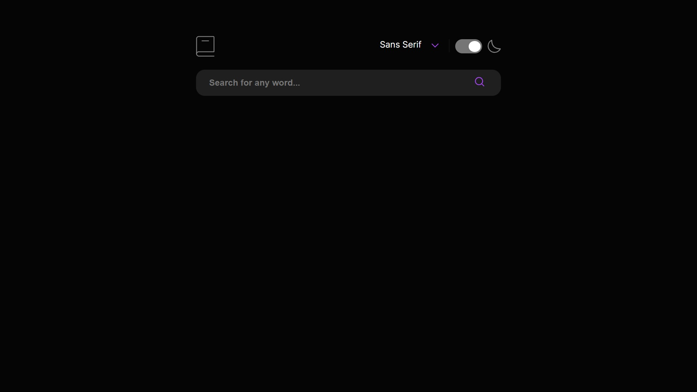
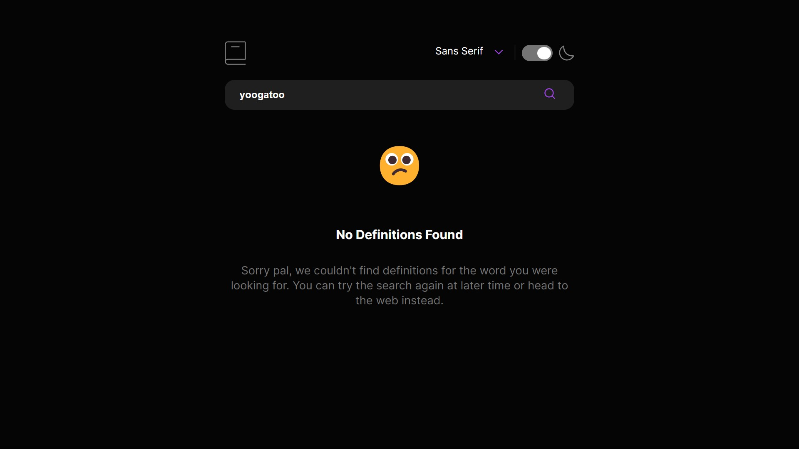

# Frontend Mentor - Interactive rating component solution

This is a solution to the [Dictionary web app challenge on Frontend Mentor](https://www.frontendmentor.io/challenges/dictionary-web-app-h5wwnyuKFL) built with React, TypeScript, Vite and SCSS. 

## Table of contents

- [Overview](#overview)
  - [The challenge](#the-challenge)
  - [Screenshot](#screenshot)
  - [Links](#links)
- [My process](#my-process)
  - [Built with](#built-with)
  - [What I learned](#what-i-learned)
  - [Continued development](#continued-development)
  - [Useful resources](#useful-resources)
- [Author](#author)

## Overview

### The challenge

Users are able to:

- Search for words using the input field
- See the Free Dictionary API's response for the searched word
- See a form validation message when trying to submit a blank form
- Play the audio file for a word when it's available
- Switch between serif, sans serif, and monospace fonts
- Switch between light and dark themes
- View the optimal layout for the interface depending on their device's screen size
- See hover and focus states for all interactive elements on the page
- Have the correct color scheme chosen for them based on their computer preferences.

### Screenshot





### Links

- [Solution URL](https://www.frontendmentor.io/solutions/dictionary-app-using-typescript-react-scss-iQkZBFt2dZ)
- [Live Site URL](https://helsel-dictionary-app.netlify.app/)

## My process

### Built with

- Semantic HTML5 markup
- Flexbox
- Mobile-first workflow
- [React](https://reactjs.org/)
- [TypeScript](https://www.typescriptlang.org/)
- [Vite](https://vitejs.dev/)
- [SCSS](https://sass-lang.com/)
- [Dictionary API](https://dictionaryapi.dev/)

### What I learned

This was my first time using TypeScript with API data, so I had to get very familiar with interfaces. I would love to see if there's a more effecient way to handle complex JSON data in TypeScript, as I feel like something a little less bulky. Looking through my code now, I feel I could at least abstract it out into another file and import that in modules that need it.

```ts
interface EntryObj {
  word: string;
  phonetics: Array<Phonetic>;
  meanings: Array<Meaning>;
  partOfSpeech: string;
  synonyms: Array<string>;
  sourceUrls: Array<string>;
}

interface Meaning {
  partOfSpeech: string;
  definitions: Array<DefinitionObj>;
  synonyms: Array<string>;
}

interface DefinitionObj {
  definition: string;
}

interface Phonetic {
  audio : string;
  text: string;
}
```

This was also my first time dealing with audio in any wev development project, which was a really fun problem to tackle. Between this and detecting the user's dark mode preference, I had to get more comfortable with the `useEffect` hook. I get a little paranoid about introducing infinite loops with this hook as I hear it's notorious for that, but my use cases are pretty simple.

In the case of audio, it was necessary to load a new audio clip whenever the user fetched a new definition. I was initially a little confused by this, as I assumed when the prop updated, the audio source link would as well. My understanding of the React application state and life cycle has grown quite a bit recently, but clearly there's a lot more to learn and study.

```ts
useEffect(() => {
  if (audioRef.current) {
    audioRef.current.load();
  }
}, [firstPhonetic.audio]);

return (
  <div className="definition-header">
    <div>
      <h1>{word}</h1>
        <h2>{firstPhonetic.text}</h2>
      </div>
      {
        (firstPhonetic.audio !== '')?
        <button onClick={handlePlay}>
          
          <audio ref={audioRef}>
            <source src={firstPhonetic.audio} type="audio/mpeg"/>
          </audio>
        </button>
        :
        <></>
      }
  </div>
)
```

As stated above I also had to use useEffect to retrieve the user's dark mode preference, and to apply a class to the body for dark mode. The use of media queries within React was a huge revelation for me that I'm eager to explore more deeply in future projects.

```ts
const [nightMode, setNightMode] = useState(false);

useEffect(() => {
  const prefersDark = window.matchMedia('(prefers-color-scheme: dark)').matches;
  setNightMode(prefersDark);
}, []);

useEffect(() => {
  document.body.className = nightMode ? 'dark' : '';
}, [nightMode]);
```

### Continued development

I'm extremely happy with the current state of this project. The mobile layout scaled very well for tablet and desktop, with very few media query rules required in my styles. I think elements of the code could use a refactor for readability, and I'd also love to squash any bugs users discover.

### Useful resources

- [W3 Schools how to change bullet color](https://www.w3schools.com/howto/howto_css_bullet_color.asp) - I was pretty shocked that the bullets in a list could not be styled, but using `::before` pseudo elements is brilliant and I have this article to thank for that idea.

## Author

- Website - [Jeremy Helsel](https://jeremyhelsel.com/)
- Frontend Mentor - [@JIH7](https://www.frontendmentor.io/profile/JIH7)
